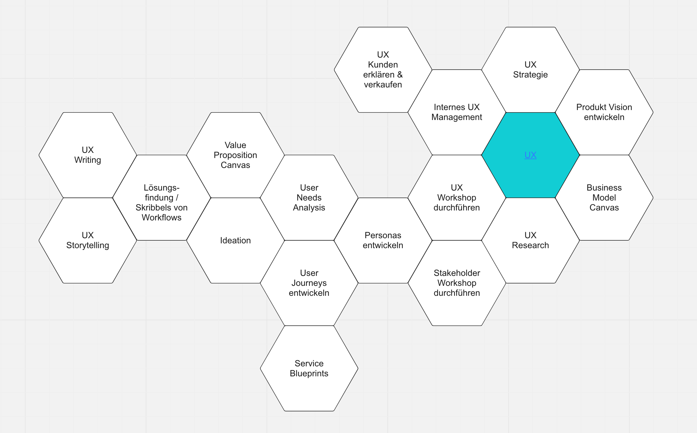
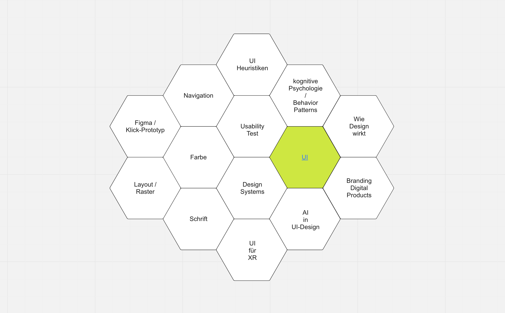
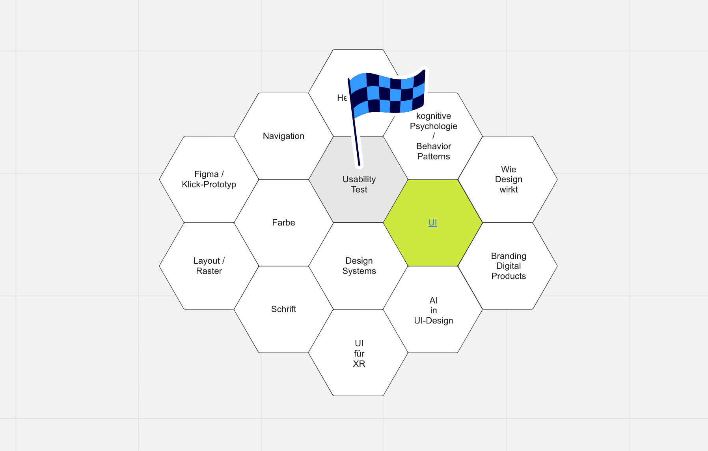

# Resources

[*Zurück zum Spielregeln*](./README.de.md)

## QAtalks

### UI-Design Quick Guide

[Folien](https://docs.google.com/presentation/d/1Kgs227H3ZJo00d8KX8Ti33RDeDNjie_Nm63G8mhQFto/edit) (nur für QAware’ler)

### User Centered Design

[Folien](https://docs.google.com/presentation/d/1g11AXz9Xs710lYQfHyy3hGKDAluWYx19aiyLZlBJy_8/edit) (nur für QAware’ler)

### Usability Test

[Folien](https://docs.google.com/presentation/d/1OITg6rVwoCCoHaN4GvXUsfHL87gDn7SJ8tsvePZDv-A/edit) (nur für QAware’ler)

### UX/UI Lernlandkarte

[Confluence](https://qaware-confluence.atlassian.net/wiki/spaces/QACAMPUS/pages/201883734/UX+UI+Lernlandkarte) (nur für QAware’ler)

> Vorerst bringt dich ein Klick auf die Landkarten UX und UI zu Präsentationen, die dir einen Überblick auf das jeweilige Thema verschaffen. Zu UI liegt mit “Usability Test” auch ein Unterthema vor, auf das du mit Klick auf die Landkarte mit gekennzeichneter Usability-Test-Kachel Zugriff erhältst. In den nächsten Ausbauschritten wird eine interaktive Lernlandkarte entwickelt, auf der du jede Kachel anklicken kannst, um auf dem entsprechenden Thema zu landen.

Landkarten

### UI Design mit Figma

[Folien](https://docs.google.com/presentation/d/1SYX1Yf6GhxBm2kbNFBHFbeEjGR0mnM65bvjr0SBKNMU/edit) (nur für QAware’ler)

## UX Qualitätszeile

- Zufriedenheit der Nutzer mit dem Tool
- Effizienz der Nutzer/ Niedrige Time to Task Completion
- Hohe Task Completion Rate
- Gesteigerte Ergebnisse durch die Nutzer-Interaktion
- Hohe Feature Adoption Rate
- Niedrige Error Rate per User
- Geringerer Support-Aufwand im laufenden Betrieb
- Geringere Produkt-Schulungskosten

## Laws of UX

[lawsofux.com](https://lawsofux.com/)

### Aesthetic-Usability Effect
Schöne Designs wirken benutzerfreundlicher.

### Doherty Threshold
Benutzerengagement steigt mit schnelleren Antwortzeiten (<400 ms).

### Fitts’s Law
Die Zeit zur Zielerreichung sinkt mit Nähe und Größe des Ziels.

### Goal-Gradient Effect
Nutzer sind motivierter, ein Ziel zu erreichen, je näher sie ihm kommen.

### Hick’s Law
Mehr Optionen erhöhen die Entscheidungszeit.

### Jakob's Law
Nutzer erwarten, dass deine Website wie andere funktioniert, die sie kennen.

### Law of Common Region
Elemente in einer Region werden als zusammengehörig wahrgenommen.

### Law of Proximity
Objekte in Nähe werden als Gruppe wahrgenommen.

### Law of Prägnanz
Einfache, klare Strukturen werden bevorzugt.

### Law of Similarity
Ähnliche Objekte werden zusammen als Teil einer Gruppe wahrgenommen.

### Law of Uniform Connectedness
Verbundene Elemente werden als eine Einheit wahrgenommen.

### Miller’s Law
Menschen können etwa 7 Informationseinheiten im Gedächtnis behalten.

### Occam’s Razor
Das einfachste Design ist vorzuziehen.

### Pareto Principle
80 % der Effekte kommen von 20 % der Ursachen.

### Parkinson’s Law
Aufgaben dehnen sich in ihrer zeitlichen Erledigung aus.

### Peak-End Rule
Nutzererinnerungen werden am stärksten von den intensivsten und letzten Erlebnissen geprägt.

### Postel's Law
Sei flexibel bei der Annahme von Nutzereingaben, aber präzise und zurückhaltend bei Ausgaben oder Aktionen.

### Serial Position Effect
Nutzer erinnern sich an den Anfang und das Ende einer Liste am besten.

### Tesler’s Law
Für jedes System gibt es eine gewisse Unvermeidlichkeit der Komplexität.

### Von Restorff Effect
Herausstechende Objekte werden besser erinnert.

### Zeigarnik Effect
Nicht abgeschlossene Aufgaben bleiben im Gedächtnis präsenter.

## Interaktions-prinzipien der ISO 9241-110 (2020)

### Aufgabenangemessenheit
Effiziente Unterstützung durch nur notwendige Schritte und sinnvolle Standardoptionen.

### Selbstbeschreibungsfähigkeit
Klare und verständliche Informationen und Systemstatusanzeigen.

### Erwartungskonformität
Konsistentes und vorhersagbares Verhalten, das sich an Nutzerkontexte anpasst.

### Erlernbarkeit
Intuitive Hinweise, risikofreies Testen und leichte Wiederaufnahme von Funktionen.

### Steuerbarkeit
Flexibilität in der Aufgabenausführung und Anpassbarkeit der Schnittstelle an individuelle Bedürfnisse.

### Robustheit gegen Benutzerfehler
Fehlerprävention, automatische Korrektur und effiziente Fehlerbehebung.

### Benutzerbindung („User Engagement“)
Motivierende Gestaltung, risikofreie Nutzung und Integration der Benutzer in Verbesserungsprozesse.

## Relevante Accessibility-Richtlinien WCAG 2.2

- Klare Struktur durch unterschiedliche Überschrift-Größen
- Einfache, für Nutzergruppe verständliche Sprache
- Ausreichender Kontrast
- Gute Lesbarkeit der Schrift (min. 12pt bzw. 16 px, Sans Serif Schriftart, min. 1,5 facher Zeilenabstand)
- Info-Grafiken nicht nur durch Farbe unterscheidbar (auch durch Text oder Schraffur)
- Objektbeschriftung außerhalb des Eingabefelds
- Animationen limitieren

## Nächste Schritte nach einem Reviews

### Nutzer

- Befragung von Nutzern aller Parteien zu Problemen und Wünschen
- Nutzern bei der Nutzung über die Schulter sehen, um zu lernen.
- Usability Test (eventuell mit neuen Prototypen)
- A/B-TEST
- Analytics auswertungen
- Predictive eye-tracking
- User Journeys entwickeln

### Eigene Business Sicht

- Mit einem Lean UX Canvas die Business-Sicht schärfen

### Markt

- Design Patterns von vergleichbarer Software analysieren
- Wettbewerbs-Analyse. Was kann vom Wettbewerb gelernt werden?
- Marktanalyse, wer braucht was wieviel und wie oft?
